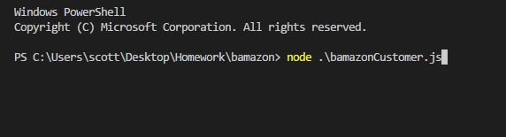
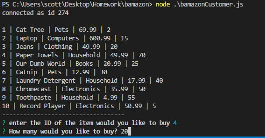
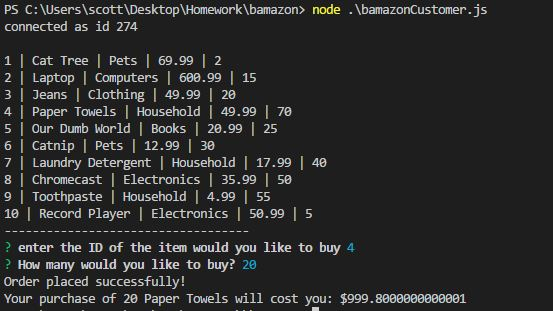
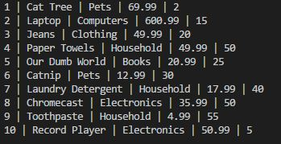

# Bamazon
A e-storefront using Node.js and MySQL. The app will take in orders from customers and adjust the stock of the store's inventory.

## Getting Started

The instructions will show you which NPM packages you will need to run the program.  Open the bamazonCustomer.js file in your text editor terminal and follow the prompts

### Prerequisites

NPM packages used

```
MySQL
Inquirer

```

**`BamazonCustomer.js`**

* Prints the products in the store.
* Prompts customer which product they would like to purchase by ID number.
* Asks customer how many they would like to purchase. If there is a sufficient amount in stock, it will return the total for that purchase. If there is not enough of the product in stock, it will tell the user that there isn't enough of the productis insufficient inventory.
* If the purchase is successful, the quantity will be reflected in the database.


### Built With

JavaScript | Node.js | MySQL

### Screenshots

Starts program




Displays available products




Displays purchase total




Updates inventory

